## 1.	Как запустить и начать использовать Watson Studio
1.1. Войти в учетную запись IBM Cloud – https://cloud.ibm.com
1.2.	В Dashboard выбрать **Cloud Foundry Services** либо **Services** и, затем, **Watson Studio**

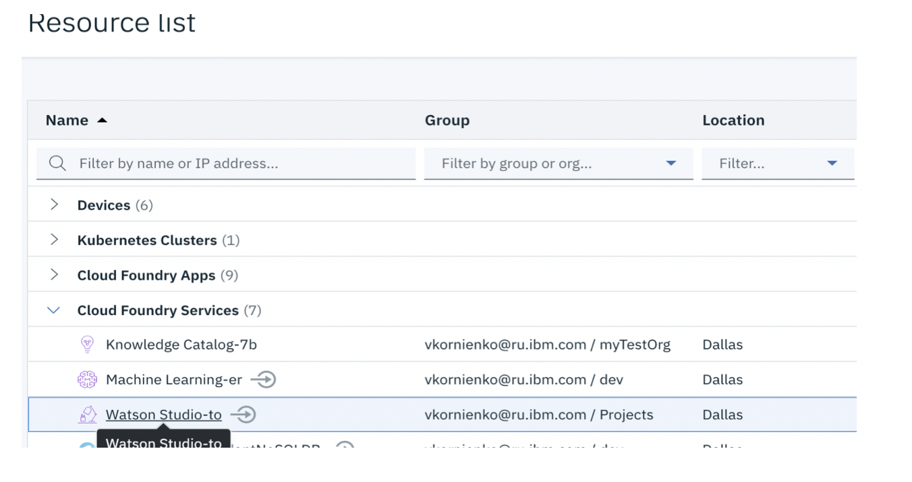

1.3 На открывшейся титульной странице сервиса Watson Studio нажать на кнопку **Get Started**

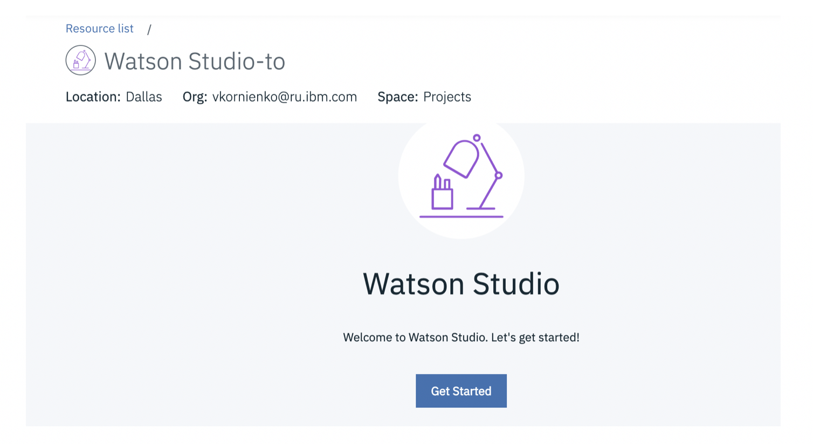

1.4 Вы – на месте:

_**Необязательно**_: короткий путь для доступа к Watson Studio – https://dataplatform.cloud.ibm.com
Введите Ваш IBM id и пароль если необходимо
Попробуйте этот подход на досуге и поделитесь с коллегой впечатлениями о простоте использования и пользовательском интерфейсе Watson Studio.

## 2.	Как создать проект и пригласить других участников
2.1.	На заглавной странице Watson Studio выберите **Create а Project**

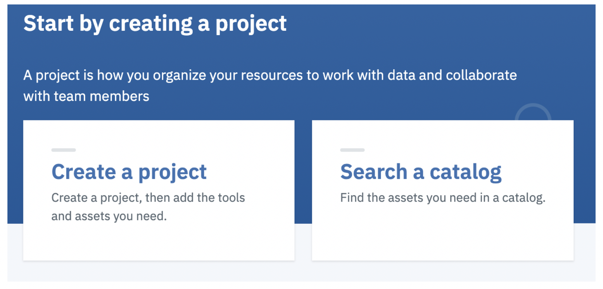

Выберите тип проекта - **Standard**

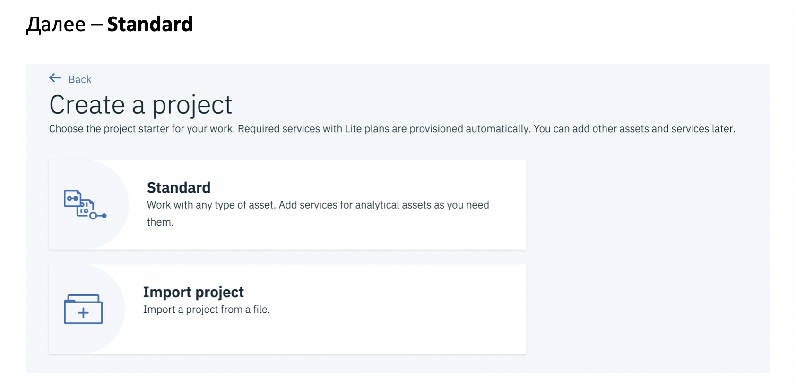

Задайте имя Вашего проекта, проверьте, выделено ли хранилище данных (Cloud Object Storage) и нажмите кнопку **Create**

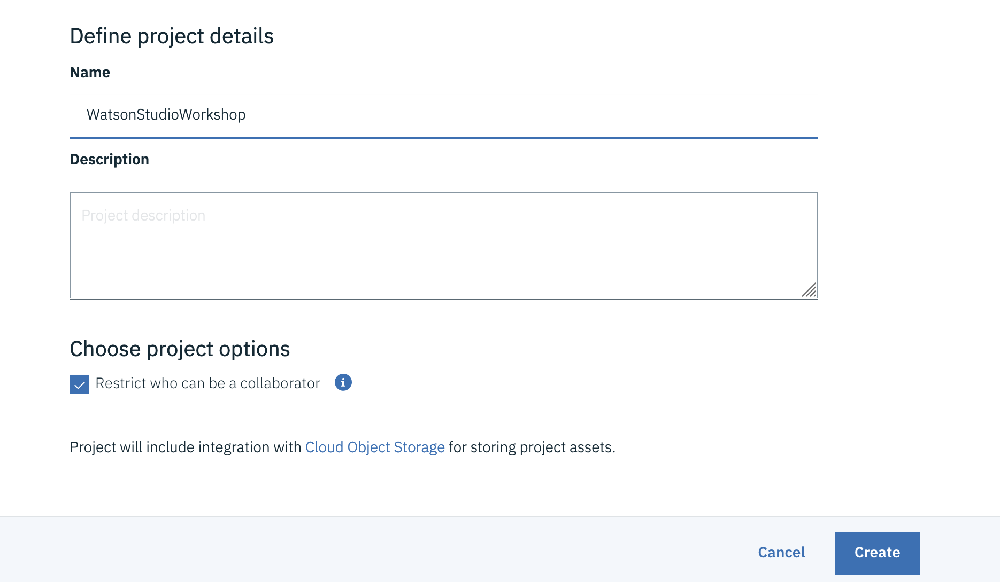

Поздравляем! Вы создали проект в Watson Studio!

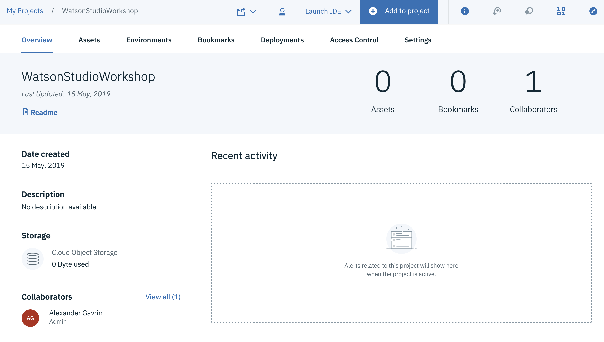

2.2.	**Необязательно**: Пригласите коллегу поработать на Вашем проекте.  

Выберите **Access Control**

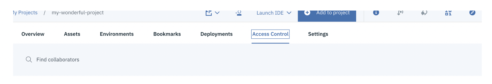

Далее, нажмите **Add Collaborators**

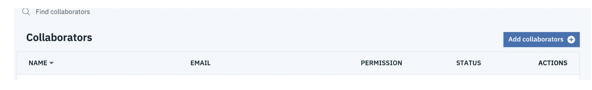

Выберите уровень доступа для коллеги (например, Editor)

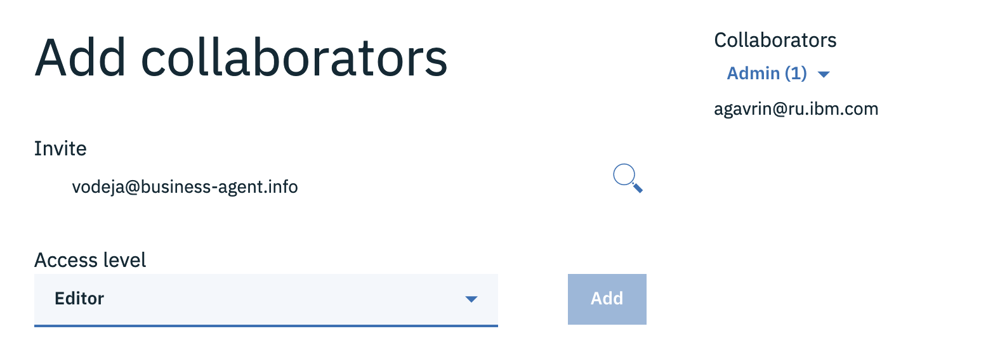

И нажмите Add и Invite последовательно

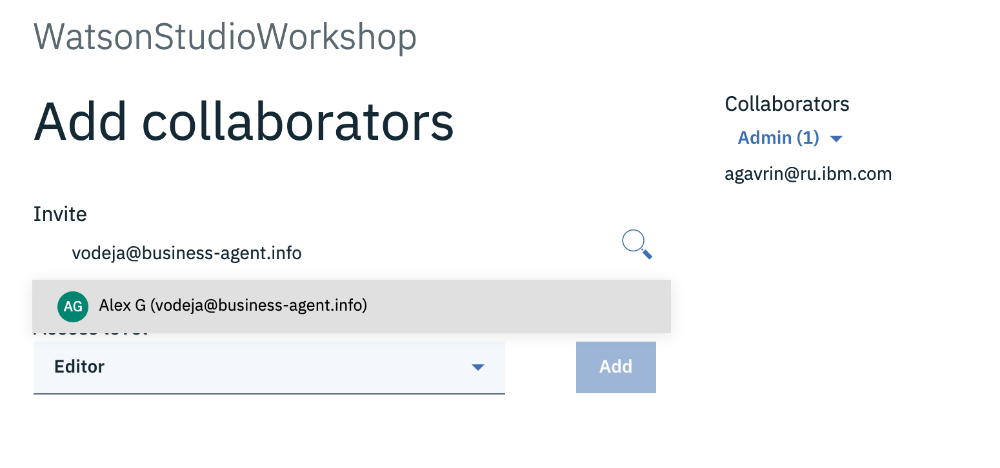

Вы пригласили коллегу поработать с Вами на проекте

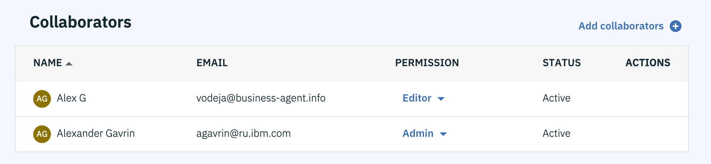

Необязательно:  Вы можете дать доступ к проекту не только людям, но и приложениям. Исследуйте самостоятельно как это делается и поделитесь знанием с коллегой.
