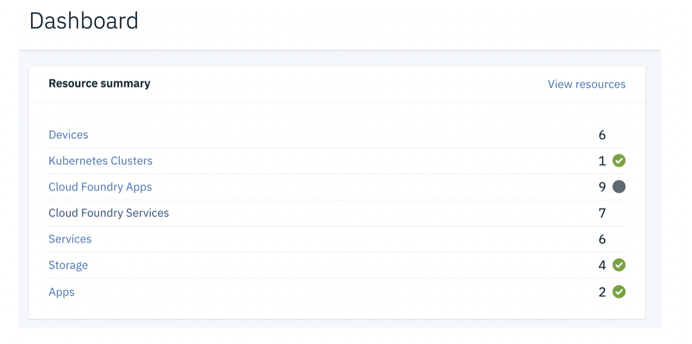

## 1.	Как запустить и начать использовать Watson Studio
1.1. Войти в учетную запись IBM Cloud – https://cloud.ibm.com
1.2.	В Dashboard выбрать **Cloud Foundry Services** либо **Services** и, затем, **Watson Studio**

1.3 На открывшейся титульной странице сервиса Watson Studio нажать на кнопку **Get Started**

1.4 Вы – на месте:

_**Необязательно**_: короткий путь для доступа к Watson Studio – https://dataplatform.cloud.ibm.com
Введите Ваш IBM id и пароль если необходимо
Попробуйте этот подход на досуге и поделитесь с коллегой впечатлениями о простоте использования и пользовательском интерфейсе Watson Studio.

## 2.	Как создать проект и пригласить других участников
2.1.	На заглавной странице Watson Studio выберите **Create а Project**
