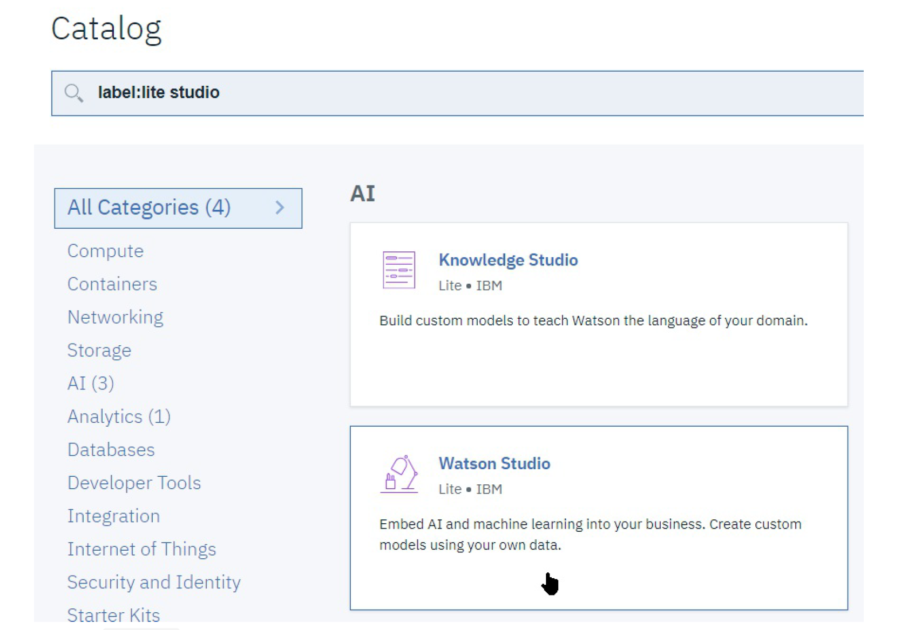
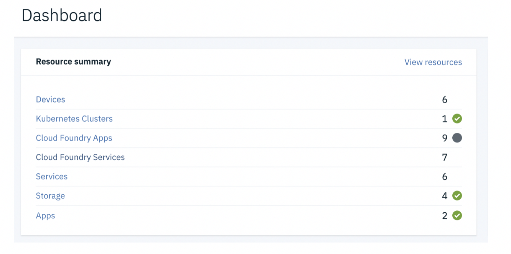
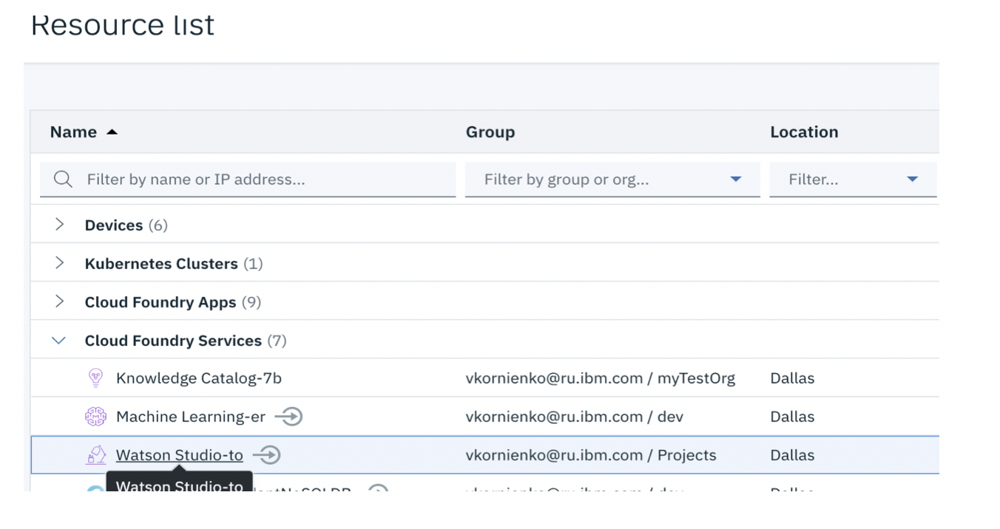
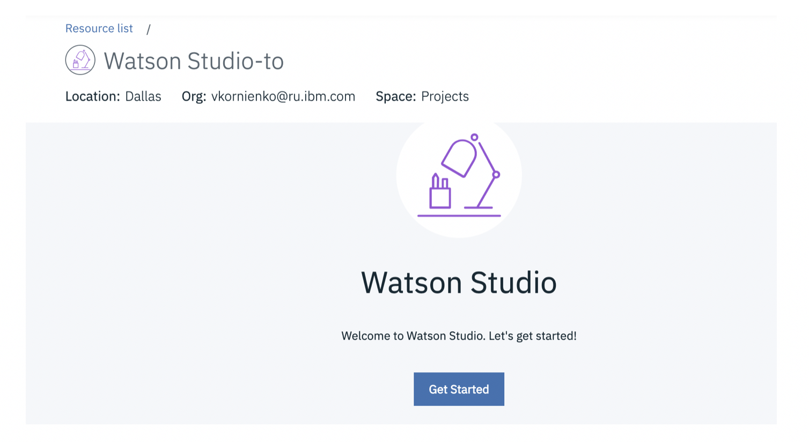
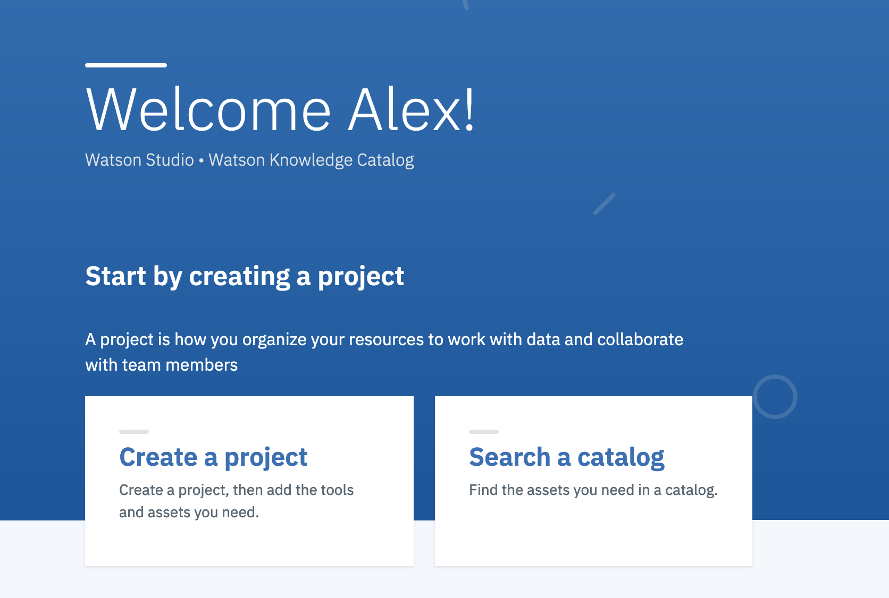

# Лабораторная работа 1 - Знакомимся с Watson Studio

В первой лабораторной работе мы познакомимся с проектами, сервисами, наборами данных в IBM Watson Studio, а также попробуем в работе наш первый Jupyter Notebook.

## Первоначальная Настройка
Watson Studio - это облачный сервис IBM, поэтому для его использования Вам будет нужно создать аккаунт в **IBM Cloud**, а затем создать Ваш собственный экземпляр **Watson Studio**.

Кроме того, так как Watson Studio использует данные и сервисы из платформы IBM Cloud, мы дополнительно создадим некоторые артифакты для использования внутри Watson Studio.

Наши шаги по освоению Watson Studio:
- Создадим экземпляр сервиса **Watson Studio**
- Создадим **проект** Watson Studio для лабораторной работы.
- Создадим набор необходимых **сервисов**.
- Загрузим **набор данных** в проект и попробуем некоторые возможности платформы

## 1. Создадим экземпляр сервиса **Watson Studio**
В нашем аккаунте IBM Cloud нам потребуется создать экземпляр сервиса Watson Studio, как точку входа в платформу. Необходимо отметить, что сделать это надо лишь один раз, так как в каждом регионе может быть создан только один экземпляр сервиса Watson Studio.

1. Войдите в рабочую панель IBM Cloud (https://cloud.ibm.com/dashboard/apps)
2. Нажмите кнопку **[Create Resource]** справа вверху
3. В поле поискового окна введите **studio**. Это ограничит список сервисов только теми, которые имеют это слово в названии:

4. Убедитесь, что Вы создаете экземпляр именно **Watson Studio**, а не другого сервиса, например **_Knowledge_** Studio. Нажмите на **Watson Studio**.

5. Вы увидите экран создания сервиса. Обратите внимание на выбор региона (**Region**), в котором будет развернут сервис. Вы можете выбрать любой, хотя мы рекомендуем использовать US-South - в этом регионе обновления сервисов происходят раньше других.

_**Обратите внимание!** Регион, где располагается сервис, указан в ссылке, которую Вы используете для доступа к Watson Studio. Доступ к сервисам в регионе US-South происходит **без префикса**, но если вы создали сервис, например, в United Kingdom, Вам нужно будет использовать префикс **eu-gb**: например, http://eu-gb.dataplatform.ibm.com ._

6. Оставьте выбранным план по умолчанию (Lite) и нажмите кнупку "Create".

**Поздравляем Вас!** Вы завершили создание рабочего экзампляра платформы Watson Studio!

## 2.	Как запустить и начать использовать Watson Studio

2.1. Войдите в Вашу учетную запись IBM Cloud – https://cloud.ibm.com

2.2. В Dashboard выберите **Services** и, затем, **Watson Studio**

2.3 На открывшейся титульной странице сервиса Watson Studio нажать на кнопку **Get Started**

2.4 Вы – на месте!

