# Лабораторная работа 2 - Начинаем работать с Watson Studio

* [Лабораторная работа 2 - Начинаем работать с Watson Studio](#лабораторная-работа-2---начинаем-работать-с-watson-studio)
   * [1.1.	Как запустить и начать использовать Watson Studio](#11как-запустить-и-начать-использовать-watson-studio)
   * [1.2.	Как создать проект и пригласить других участников](#12как-создать-проект-и-пригласить-других-участников)
   * [1.3.	Как создать и обучить модель с помощью Jupyter Notebook](#13как-создать-и-обучить-модель-с-помощью-jupyter-notebook)

## 1.1.	Как запустить и начать использовать Watson Studio
1.1.1. Войти в учетную запись IBM Cloud – https://cloud.ibm.com
1.1.2.	В Dashboard выбрать **Cloud Foundry Services** либо **Services** и, затем, **Watson Studio**

1.1.3 На открывшейся титульной странице сервиса Watson Studio нажать на кнопку **Get Started**

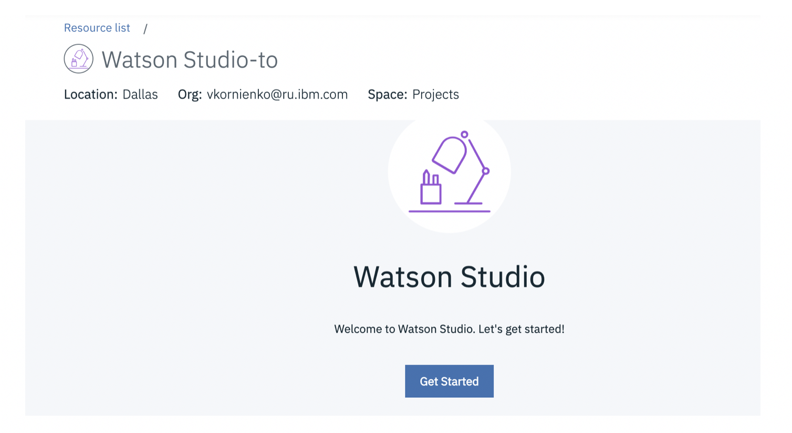

1.1.4 Вы – на месте:

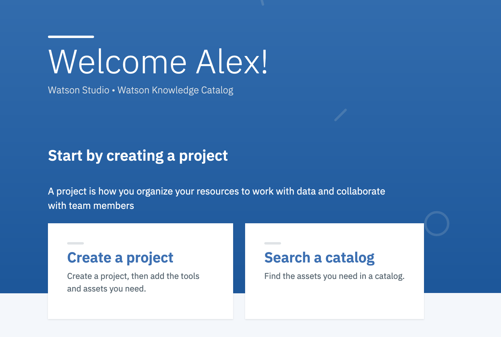

_**Необязательно**_: короткий путь для доступа к Watson Studio – https://dataplatform.cloud.ibm.com. Введите Ваш IBM id и пароль если необходимо. Попробуйте этот подход на досуге и поделитесь с коллегой впечатлениями о простоте использования и пользовательском интерфейсе Watson Studio.

## 1.2.	Как создать проект и пригласить других участников
1.2.1.	На заглавной странице Watson Studio выберите **Create а Project**

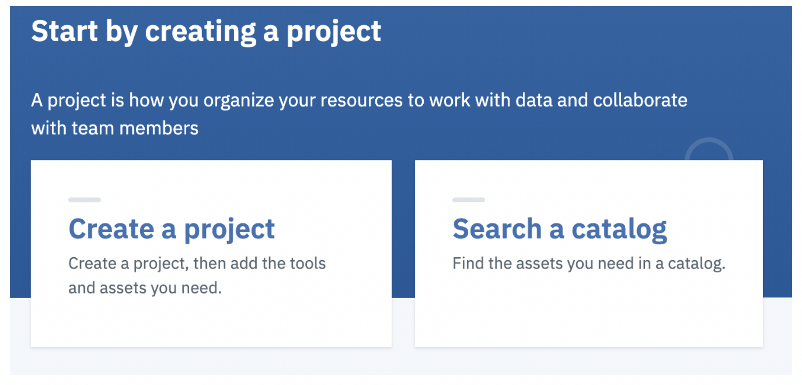

Выберите тип проекта - **Standard**

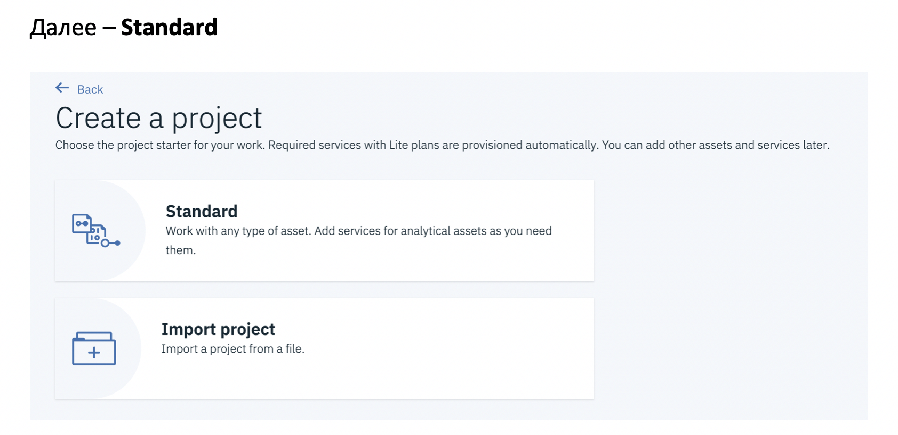

Задайте имя Вашего проекта, проверьте, выделено ли хранилище данных (Cloud Object Storage) и нажмите кнопку **Create**

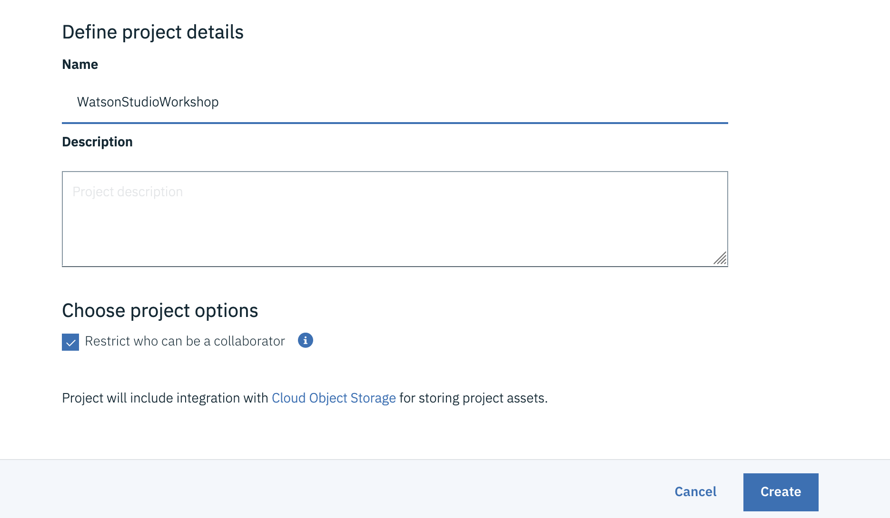

Поздравляем! Вы создали проект в Watson Studio!

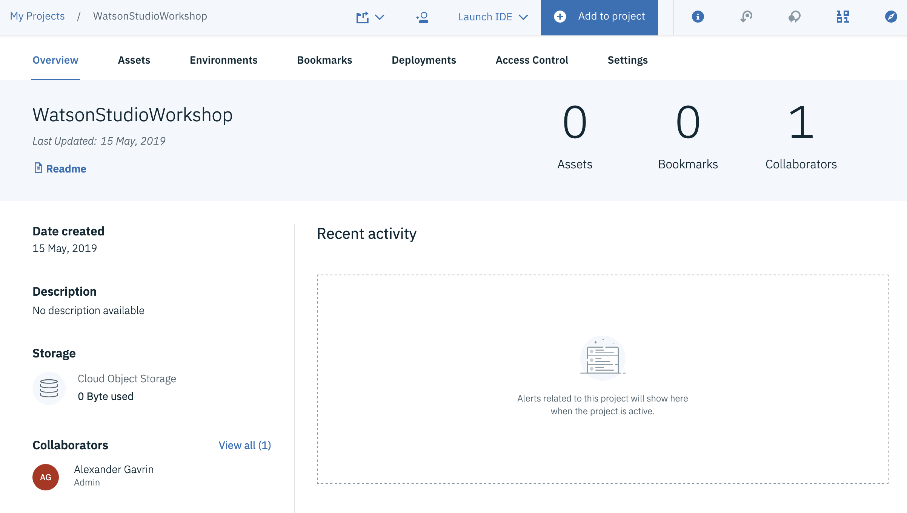

1.2.2.	**Необязательно**: Пригласите коллегу поработать на Вашем проекте.  

Выберите **Access Control**

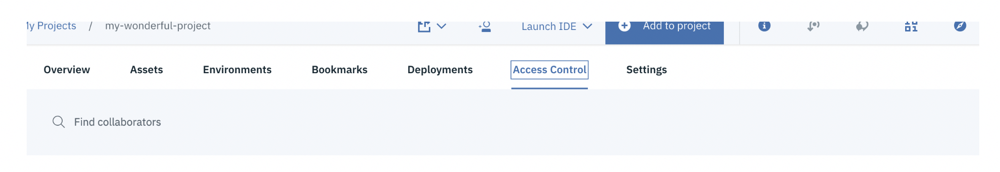

Далее, нажмите **Add Collaborators**

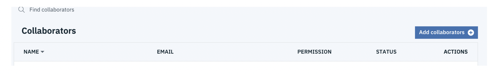

Выберите уровень доступа для коллеги (например, Editor)

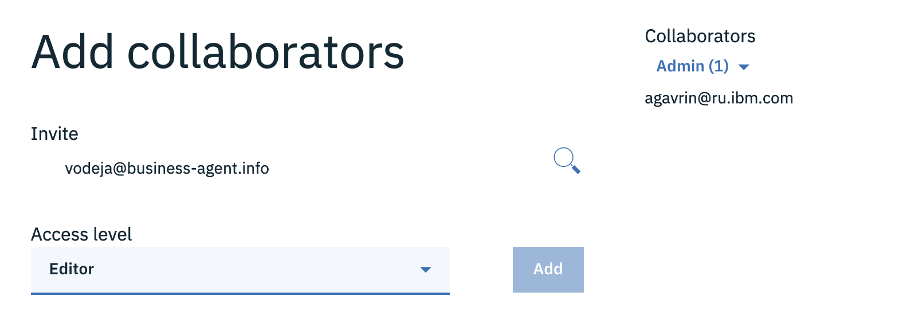

И нажмите Add и Invite последовательно

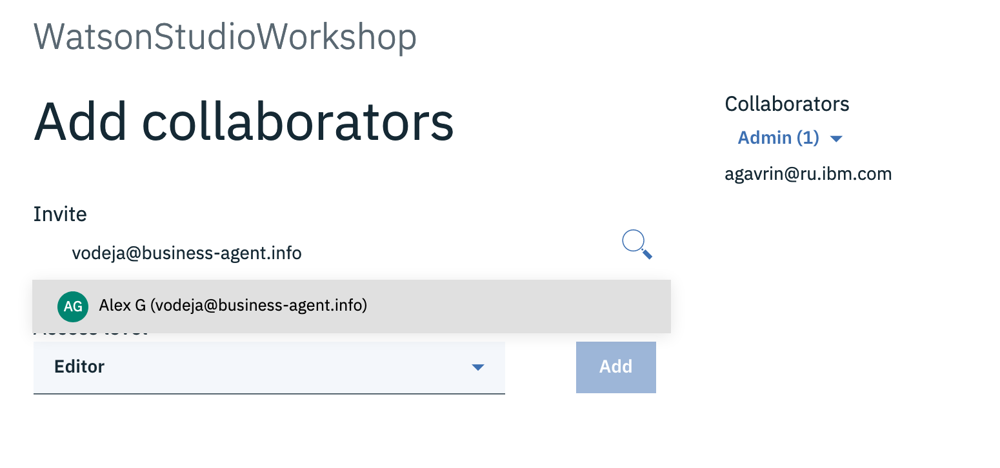

Вы пригласили коллегу поработать с Вами на проекте

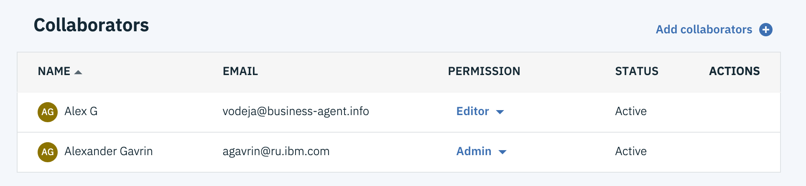

Необязательно:  Вы можете дать доступ к проекту не только людям, но и приложениям. Исследуйте самостоятельно как это делается и поделитесь знанием с коллегой.

## 1.3.	Как создать и обучить модель с помощью Jupyter Notebook
Типичная работа инженера по работе с данными (Data Scientist) предполагает построение моделей (кодирование) на Python, R или Scala. Далее мы ознакомимся с типичным Jupyter Notebook на Python.

В рамках Вашего проекта в Watson Studio нажмите **Add to project** и выберите **Notebook**.

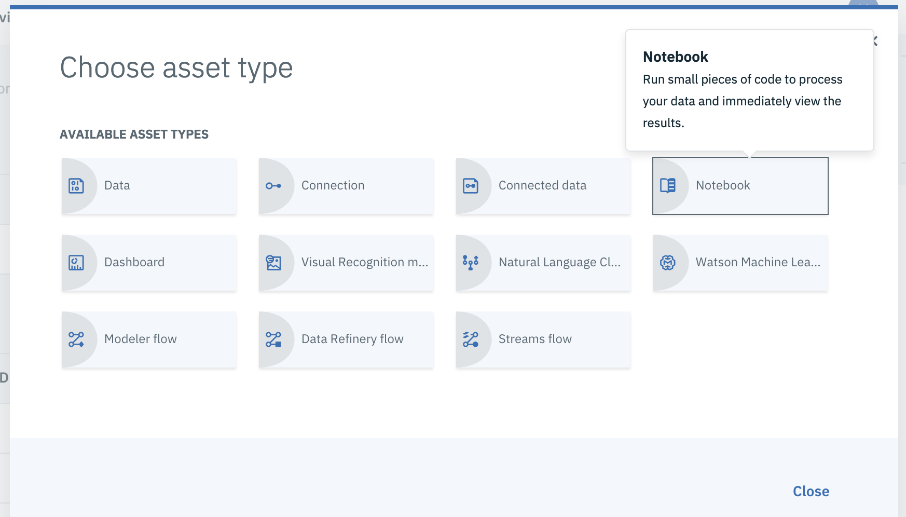

Выберите "From URL" и введите следующие данные: 

Notebook URL: **`https://ibm.biz/BdzZwi`** 
Name: **`Data Analysis with Python`** 
Select Runtime: **Default Python 3.5 Free (1 vCPU and 4 GB RAM)**

Нажите **Create notebook**

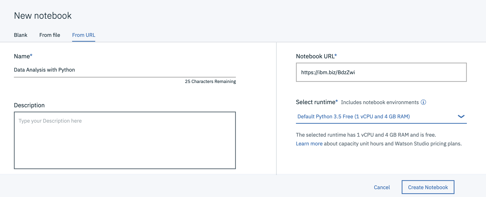

Ваш Jupyter Notebook загружен и готов к работе. Выберите в меню Cell -> Run all

Обсудите результат работы ноутбука, возможности выполнения ячеек и скорости обучения моделей, возможности Watson Studio по коллективной работе, контролю версий, изменений kernel (runtime), безопасности доступа и контролю кода, легкости подключения данных, идентичности с open source средами с точки зрения user experience.
